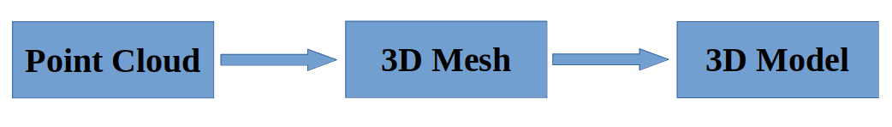
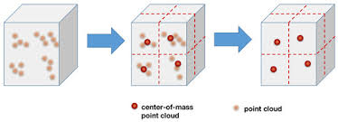
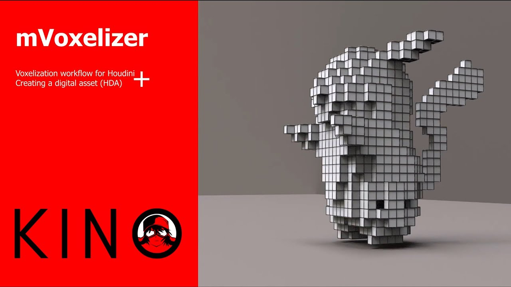
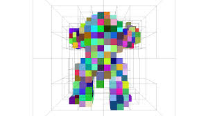

# SLAM – Simultaneous Localization and Mapping and 3D Computer Vision
# Open3D – Complete Guide with Examples
---

## 📌 Table of Contents

* [3D Point Cloud](#3d-point-cloud)
* [Voxel Downsampling](#voxel-downsampling)
* [Outlier Removal](#outlier-removal)
* [KD-Tree](#kd-tree)
* [3D Mesh](#3d-mesh)
* [Mesh Operations](#mesh-operations)
* [Sampling](#sampling)
* [RGBD Handling](#rgbd-handling)
* [Voxelization](#voxelization)
* [Octree](#octree)
* [Surface Reconstruction](#surface-reconstruction)
* [Transformations](#transformations)
* [Mesh Deformation](#mesh-deformation)
* [Intrinsic Shape Signatures](#intrinsic-shape-signatures)
* [Ray Casting](#ray-casting)
* [Registration (ICP)](#registration-icp)
* [Visualization](#visualization)
* [Web Visualizer](#web-visualizer)
* [Open3D for TensorBoard](#open3d-for-tensorboard)
* [Built‑in Datasets](#built-in-datasets)
* [Important Techniques](#important-techniques)

---

# 🟦 3D Point Cloud — Overview & Open3D Guide


A **Point Cloud** is a collection of points in 3D space representing the geometry, structure, and surface of real-world or simulated objects.  
Each point contains **X, Y, Z coordinates**, and may also include:

- **Color (R, G, B)**
- **Intensity values**
- **Surface normals**
- **Segmentation labels / classes**

Point clouds are essential in robotics, computer vision, mapping, and 3D modeling.

---

## 🚀 Applications of Point Clouds

Point clouds are commonly used in:

- ✅ **Robotics** (SLAM, mapping, navigation)  
- ✅ **Computer Vision**  
- ✅ **Autonomous Vehicles** (LiDAR processing)  
- ✅ **3D Scanning & Photogrammetry**  
- ✅ **VR/AR & 3D Modeling**  
- ✅ **Surveying, GIS & Construction**  

---

## 📁 Common Point Cloud File Formats

| Format   | Description |
|----------|-------------|
| **.pcd** | Point Cloud Data (native for Open3D & PCL) |
| **.ply** | Polygon File Format (supports point clouds + meshes) |
| **.xyz** | Simple list of XYZ coordinates |
| **.xyzn**| XYZ + Normal vectors |
| **.rgb** | Contains per-point color information |

---

## 🔧 Load & Visualize a Point Cloud (Open3D)

```python
import open3d as o3d
import numpy as np

# Load the point cloud file
pcd = o3d.io.read_point_cloud("test.pcd")

# Print basic information
print(pcd)
print(np.asarray(pcd.points))

# Visualize the point cloud
o3d.visualization.draw(pcd)
## 🟦 Voxel Downsampling

Used to reduce the number of points for faster computation.

### 🔹 Example

```python
pcd_down = pcd.voxel_down_sample(voxel_size=0.02)
o3d.visualization.draw(pcd_down)
```
---

# 🟦 3D Mesh — Overview & Open3D Guide

A **3D Mesh** is the structural backbone of a 3D model.  
It can be created from **point clouds** or designed directly in 3D modeling software.  

A 3D Mesh is composed of:

- **Vertices**: Points in 3D space  
- **Edges**: Lines connecting vertices  
- **Faces**: Surfaces defined by edges (usually triangles or quads)  

These components together define the **height, width, and depth** of a 3D object.

---

## 🚀 Applications of 3D Mesh

3D Meshes are widely used in:

- **Computer Graphics & Animation**  
- **3D Printing**  
- **Virtual Reality (VR) & Augmented Reality (AR)**  
- **Simulation & Gaming**  
- **Medical Imaging & Scientific Visualization**  
- **Robotics & CAD Modeling**

---

## 📁 Common 3D Mesh File Formats

| Format | Description |
|--------|-------------|
| **.ply** | Polygon File Format (supports point cloud + mesh) |
| **.stl** | Standard for 3D printing (triangular mesh) |
| **.obj** | Wavefront OBJ (vertices, faces, textures) |
| **.off** | Object File Format (geometry representation) |
| **.gltf / .glb** | Modern format for 3D scenes & models with textures |

---

## 🔧 Load & Visualize a 3D Mesh with Open3D

```python
import open3d as o3d

# Load a 3D mesh file
mesh = o3d.io.read_triangle_mesh("model.ply")

# Print basic information
print(mesh)
print("Vertices:", len(mesh.vertices))
print("Triangles:", len(mesh.triangles))

# Estimate normals (needed for better visualization)
mesh.compute_vertex_normals()

# Visualize the mesh
o3d.visualization.draw(mesh)
```
## 🟦 3D Model — Overview & Open3D Guide

A **3D Model** is a digital representation of a three-dimensional object or scene.  
It is used in **animation, movies, video games, architecture, product design, and commercial advertisements**.  

The **core of a 3D model** is a **3D Mesh**, which defines the structure (vertices, edges, faces).  
Unlike a mesh, a 3D model can also include:

- **Color information** (vertex colors or textures)  
- **Surface textures / materials**  
- **Lighting properties**  
- **Animation rigging (for animated models)**  

---

## 🚀 Applications of 3D Models

3D Models are widely used in:

- **Animation & Visual Effects (VFX)**  
- **Video Games & VR/AR experiences**  
- **Architectural Visualization & Interior Design**  
- **Product Design & Commercial Advertisements**  
- **Scientific Visualization**  
- **Robotics and Simulation Environments**

---

## 📁 Common 3D Model File Formats

| Format | Description |
|--------|-------------|
| **.obj** | Wavefront OBJ (supports geometry, textures, materials) |
| **.fbx** | Autodesk FBX (geometry, materials, animation data) |
| **.stl** | Standard Triangle Language (geometry only) |
| **.ply** | Polygon File Format (mesh + vertex colors) |
| **.glb / .gltf** | Modern format for 3D scenes with textures & animations |
| **.3ds** | 3D Studio Mesh (geometry, materials, textures) |

---

## 🔧 Load & Visualize a 3D Model with Open3D

Open3D can load models in **mesh-supported formats** like `.ply`, `.obj`, `.stl`:

```python
import open3d as o3d

# Load a 3D model
model = o3d.io.read_triangle_mesh("model.obj")

# Print basic information
print(model)
print("Vertices:", len(model.vertices))
print("Triangles:", len(model.triangles))

# Compute vertex normals (for better visualization)
model.compute_vertex_normals()

# Visualize the 3D model
o3d.visualization.draw(model)

```
---
# 🟦 Voxel Downsampling — 3D Point Cloud Preprocessing

**Voxel Downsampling** is a common preprocessing technique in 3D point cloud processing.  

A **voxel** is a small 3D box that contains multiple points from a point cloud.  
During **downsampling**, all points within a voxel are represented by a single point (usually the centroid).  

This reduces the **total number of points** in the point cloud, which helps:

- ✅ Reduce computational cost  
- ✅ Speed up processing  
- ✅ Remove redundant information  

---


## 🔧 Example: Voxel Downsampling with Open3D

```python
import open3d as o3d
import numpy as np

# Load the point cloud
pcd = o3d.io.read_point_cloud("test.pcd")
print("Original points:", np.asarray(pcd.points).shape[0])

# Apply voxel downsampling
voxel_size = 0.05  # Size of each voxel (adjust as needed)
downsampled_pcd = pcd.voxel_down_sample(voxel_size=voxel_size)
print("Downsampled points:", np.asarray(downsampled_pcd.points).shape[0])

# Visualize the downsampled point cloud
o3d.visualization.draw(downsampled_pcd)
```
# 🟦 Open3D Library — Overview

[Open3D](http://www.open3d.org/) is an open-source library designed for **3D data processing**, primarily **point clouds, meshes, and RGB-D images**.  
It is a **C++ library with Python bindings** and supports GPU acceleration, making it suitable for both research and real-world applications.

---

## 🚀 Key Features of Open3D

- **Cross-platform support**: Linux, Windows, macOS, ARM architectures  
- **GPU acceleration**: Multi-GPU and cross-GPU support  
- **Python support**: Versions 3.7 – 3.12  
- **Cloud deployment**: Actively deployed in cloud environments  
- **Documentation builder**: Generates offline web documentation  
- **Docker image available** for easy deployment  

**Core capabilities include:**

- 3D reconstruction of scenes and objects  
- Map creation for robotics (SLAM & navigation)  
- Segmentation and clustering of point clouds  
- Depth estimation from RGB-D data  
- 3D data structures (point clouds, meshes, voxel grids)  
- Surface alignment and registration  
- PBR rendering for realistic visualization  
- 3D visualization of point clouds and meshes  

---

## 🧰 Common Operations in Open3D

Open3D provides utilities to manipulate and analyze 3D data:

- Read and write **3D data** (`.pcd`, `.ply`, `.obj`, `.stl`)  
- Visualize point clouds and meshes  
- Upscale / downscale point clouds  
- Access **X, Y, Z coordinates** of points  
- Remove **outliers** and add **noise**  
- Segmentation and clustering (DBSCAN, plane segmentation)  
- **Point cloud reconstruction**  
- **Voxel downsampling**  
- **Vertex normal estimation**  
- Crop and paint point clouds  
- Compute **point cloud distances**  
- Compute **bounding volumes** and **convex hulls**  
- Detect **plane patches** and hidden points  

---

## 🔧 Example: Basic Open3D Workflow

```python
import open3d as o3d

# Load a point cloud
pcd = o3d.io.read_point_cloud("test.pcd")
print("Original points:", len(pcd.points))

# Remove outliers
cl, ind = pcd.remove_statistical_outlier(nb_neighbors=20, std_ratio=2.0)
pcd_clean = pcd.select_by_index(ind)

# Estimate normals
pcd_clean.estimate_normals(search_param=o3d.geometry.KDTreeSearchParamHybrid(radius=0.1, max_nn=30))

# Downsample the point cloud
pcd_down = pcd_clean.voxel_down_sample(voxel_size=0.05)

# Visualize
o3d.visualization.draw(pcd_down)

# 🟦 Mesh Operations — Open3D Guide

Meshes are the **structural backbone of 3D models**.  
Open3D provides a variety of operations to process, analyze, and manipulate meshes efficiently.
```
---

## 🔧 Common Mesh Operations

### ✔ Visualization
- Render meshes interactively  
- Inspect vertices, edges, and faces  

### ✔ Surface Normal Estimation
- Compute **vertex normals** or **face normals** for shading and surface analysis  

### ✔ Mesh Cropping
- Crop mesh regions based on **bounding boxes or selection polygons**  

### ✔ Mesh Painting
- Assign colors to vertices or faces  
- Visualize segmentation or attributes  

### ✔ Mesh Filtering
- Remove noise or smooth surfaces  
- **Average filtering**: Smooths vertices based on neighbors  
  - **Laplacian Filtering**  
  - **Taubin Filtering**

---

## 🧰 Mesh Properties

- **Edge manifold**: Checks if edges belong to one or two faces  
- **Vertex manifold**: Checks if vertices have a consistent neighborhood structure  
- Compute area, volume, and curvature  

---

## ✔ Mesh Sampling & Subdivision

- **Mesh Subdivision**: Divide each triangle into smaller sub-triangles to increase mesh resolution  
- **Mesh Simplification**: Reduce high-resolution meshes to fewer vertices and triangles  
- **Mesh Vertex Clustering**: Merge vertices within clusters to simplify geometry  
- **Mesh Decimation**: Common method for mesh simplification while preserving overall shape  

---

## 🔧 Example: Mesh Processing with Open3D

```python
import open3d as o3d

# Load a mesh
mesh = o3d.io.read_triangle_mesh("model.ply")

# Compute vertex normals
mesh.compute_vertex_normals()

# Visualize mesh
o3d.visualization.draw(mesh)

# Mesh filtering: Laplacian smoothing
mesh_filtered = mesh.filter_smooth_laplacian(number_of_iterations=5)
o3d.visualization.draw(mesh_filtered)

# Mesh simplification (vertex clustering)
mesh_simplified = mesh.simplify_vertex_clustering(
    voxel_size=0.05,
    contraction=o3d.geometry.SimplificationContraction.Average
)
o3d.visualization.draw(mesh_simplified)

# 🟦 RGB-D Images Handling — Open3D Guide

**RGB-D images** contain both **color (RGB)** and **depth (D)** information.  
They are commonly used in **3D reconstruction, robotics, and computer vision**.
```
---

## 🔹 Supported Datasets

- **Redwood Dataset**  
- **SUN RGB-D Dataset**  
- **NYU Depth Dataset**  
- **TUM RGB-D Dataset**  

These datasets provide aligned RGB and depth images suitable for creating point clouds.

---

## 🔹 Operations with Open3D

Using Open3D, you can:

- Read and write RGB-D images  
- Filter and crop images  
- Visualize RGB-D frames  
- Convert RGB-D images into **3D point clouds**  

---

## 🔧 Example: Convert RGB-D Image to Point Cloud

```python
import open3d as o3d

# Load RGB and Depth images
color_raw = o3d.io.read_image("color.png")
depth_raw = o3d.io.read_image("depth.png")

# Create RGBD image
rgbd_image = o3d.geometry.RGBDImage.create_from_color_and_depth(
    color_raw, depth_raw, depth_scale=1000.0, convert_rgb_to_intensity=False
)

# Convert to point cloud using a default pinhole camera
pcd = o3d.geometry.PointCloud.create_from_rgbd_image(
    rgbd_image,
    o3d.camera.PinholeCameraIntrinsic(
        o3d.camera.PinholeCameraIntrinsicParameters.PrimeSenseDefault
    )
)

# Visualize the point cloud
o3d.visualization.draw(pcd)
```
# 🟦 KD-Tree — Nearest Neighbor Search in Point Clouds

A **KD-Tree (K-Dimensional Tree)** is a spatial data structure used to **efficiently find nearest neighbors** in multidimensional data, such as **3D point clouds**.  

It is commonly used in **point cloud processing** for tasks like:

- Nearest neighbor search  
- Radius-based search  
- K-nearest neighbors (KNN) queries  
- Surface reconstruction and normal estimation  

---

## 🔧 Example: KD-Tree in Open3D

```python
import open3d as o3d
import numpy as np

# Load point cloud
pcd = o3d.io.read_point_cloud("test.pcd")

# Build KD-Tree
pcd_tree = o3d.geometry.KDTreeFlann(pcd)

# Query: find 5 nearest neighbors of the first point
[k, idx, dist] = pcd_tree.search_knn_vector_3d(pcd.points[0], 5)
print("Indices of nearest neighbors:", idx)
print("Distances to nearest neighbors:", dist)

# 🟦 Point Cloud Outlier Removal — Open3D Guide

Real-world **point clouds** often contain **noise or outliers** introduced by sensors such as LiDAR or depth cameras.  
Open3D provides several techniques to **clean point clouds** for better processing and analysis.
```
---

## 🔹 Common Techniques for Outlier Removal

1. **Voxel Downsampling**  
   - Reduces point density and removes minor noise  
   - Groups points into voxels and replaces them with a representative point  

2. **Statistical Outlier Removal**  
   - Removes points that are far from the average distance of their neighbors  
   - Useful for reducing scattered noise  

3. **Radius Outlier Removal**  
   - Removes points with too few neighbors within a specified radius  
   - Effective for sparse noise and isolated points  

---

## 🔧 Example: Statistical Outlier Removal

```python
import open3d as o3d

# Load a point cloud
pcd = o3d.io.read_point_cloud("test.pcd")
print("Original points:", len(pcd.points))

# Statistical outlier removal
cl, ind = pcd.remove_statistical_outlier(nb_neighbors=20, std_ratio=2.0)
pcd_clean = pcd.select_by_index(ind)

print("Points after cleaning:", len(pcd_clean.points))

# Visualize original and cleaned point cloud
o3d.visualization.draw(pcd)
o3d.visualization.draw(pcd_clean)
```
# 🟦 Voxelization — 3D Point Cloud & Mesh

**Voxelization** is the process of converting **3D data** (point clouds or meshes) into a **regular grid of voxels**.  
A voxel is a **3D equivalent of a pixel** — a small cube that represents space occupancy.

---

## 🔹 Why Voxelization?

- **Point Clouds and Meshes** are flexible but have irregular shapes  
- **Voxels** provide a **regular, uniform representation** of 3D space  
- Useful for **3D deep learning, occupancy grids, collision detection, and simulation**

---

## 🔹 How It Works

### Mesh Voxelization
- Create voxels from a triangle mesh  
- All voxels intersected by a triangle are set to **1 (occupied)**  
- Other voxels are **0 (empty)**  

### Point Cloud Voxelization
- A voxel is considered **occupied** if **at least one point** from the point cloud lies inside it  

---

## 🔧 Example: Voxelization with Open3D

```python
import open3d as o3d

# Load a mesh
mesh = o3d.io.read_triangle_mesh("model.ply")

# Convert mesh to voxel grid
voxel_size = 0.05  # size of each voxel
voxel_grid = o3d.geometry.VoxelGrid.create_from_triangle_mesh(mesh, voxel_size=voxel_size)

# Visualize voxel grid
o3d.visualization.draw(voxel_grid)
```
# 🟦 Inclusion Test — Voxel Grid

**Inclusion Test** is a technique to check whether points are **inside an occupied voxel** in a voxel grid.  
It is commonly used in **collision detection, occupancy mapping, and 3D analysis**.

---

## 🔹 How It Works

- A **voxel grid** divides 3D space into regular cubes (voxels)  
- Voxels can be **occupied (1)** or **empty (0)**  
- To check inclusion, verify if a **point lies inside an occupied voxel**  

This allows for **fast spatial queries** on 3D data.

---

## 🔧 Example: Inclusion Test with Open3D

```python
import open3d as o3d
import numpy as np

# Load a mesh and create voxel grid
mesh = o3d.io.read_triangle_mesh("model.ply")
voxel_size = 0.05
voxel_grid = o3d.geometry.VoxelGrid.create_from_triangle_mesh(mesh, voxel_size=voxel_size)

# Example point to test
point = np.array([0.1, 0.2, 0.3])

# Check if point is inside an occupied voxel
voxel_index = voxel_grid.get_voxel(point)
if voxel_index is not None:
    print(f"Point {point} is inside an occupied voxel {voxel_index}.")
else:
    print(f"Point {point} is NOT inside any occupied voxel.")

# 🟦 Voxel Carving — 3D Shape Reconstruction

**Voxel Carving** is a technique used to reconstruct a **3D shape** by removing empty space from a voxel grid using **depth maps or multiple views**.  
It is widely used in **3D reconstruction, computer vision, and robotics**.
```
---

## 🔹 How It Works

1. Start with a **dense voxel grid** that contains the bounding volume of the object.  
2. Use **depth maps** or multiple camera views to determine which voxels are **empty**.  
3. Remove the empty voxels, leaving only the **occupied voxels** representing the 3D shape.  
4. The remaining voxel grid represents the **3D object**.

This method is also called **space carving** and is effective for reconstructing objects from multiple images.

---

## 🔧 Example: Voxel Carving Concept (Pseudocode)

```python
# Pseudocode for voxel carving
# Assume: voxel_grid is a 3D grid containing all voxels
#         depth_maps is a list of camera depth images

for voxel in voxel_grid:
    for depth_map, camera in depth_maps:
        # Project voxel into camera view
        pixel = project_voxel_to_image(voxel, camera)
        # If voxel is in front of surface in depth map, mark as empty
        if voxel_in_free_space(pixel, depth_map):
            voxel_grid.remove(voxel)
```
# 🟦 Octree — 3D Spatial Data Structure

An **Octree** is a hierarchical data structure used to **partition 3D space**.  
It recursively divides a 3D volume into **eight smaller cubes (nodes)**, which can further subdivide as needed.


---

## 🔹 Why Use Octree?

- Efficiently **organizes and searches 3D points**  
- Handles **large point clouds** without consuming excessive memory  
- Supports **fast nearest neighbor search, collision detection, and spatial queries**  
- Useful in **3D reconstruction, graphics, robotics, and visualization**

---

## 🔹 How It Works

1. Start with a **root cube** containing all points.  
2. If a cube contains more than a predefined number of points, **split it into 8 child cubes**.  
3. Recursively apply this splitting until **leaf nodes** satisfy the resolution or point count criteria.  
4. Traversal allows efficient **search, insertion, and deletion** of points.

---

## 🔧 Example: Octree in Open3D

```python
import open3d as o3d

# Load point cloud
pcd = o3d.io.read_point_cloud("test.pcd")

# Create an octree with specified maximum depth
octree = o3d.geometry.Octree(max_depth=4)
octree.convert_from_point_cloud(pcd, size_expand=0.01)

# Visualize octree
o3d.visualization.draw(octree)
```
# 🟦 Surface Reconstruction — 3D Point Clouds & Meshes

**Surface Reconstruction** is the process of creating a **continuous surface** from a set of points or an irregular mesh.  
It is often required when raw point clouds or scanned meshes are **noisy or incomplete**.

---

## 🔹 Why Surface Reconstruction?

- Raw point clouds often have **holes, noise, or irregular shapes**  
- Reconstructing a smooth surface is essential for:  
  - 3D modeling  
  - Simulation  
  - Mesh-based rendering  
  - Finite element analysis  

---

## 🔹 Common Methods

### 1. Alpha Shape
- Reconstructs surface by **connecting nearby points**  
- Captures fine structures while preserving sharp edges  
- Useful for sparse point clouds  

### 2. Ball Pivoting
- Concept: **Roll a virtual ball** over the point cloud  
- Connects points the ball touches to create a mesh  
- Handles curved surfaces naturally  

### 3. Poisson Surface Reconstruction
- Uses **points and their normals** to generate a smooth surface  
- Produces **watertight meshes**  
- Excellent for **dense point clouds** with oriented normals  

---

## 🔧 Example: Poisson Surface Reconstruction in Open3D

```python
import open3d as o3d

# Load point cloud
pcd = o3d.io.read_point_cloud("test.pcd")

# Estimate normals (required for Poisson reconstruction)
pcd.estimate_normals(search_param=o3d.geometry.KDTreeSearchParamHybrid(radius=0.1, max_nn=30))

# Apply Poisson surface reconstruction
mesh, densities = o3d.geometry.TriangleMesh.create_from_point_cloud_poisson(pcd, depth=8)

# Visualize reconstructed mesh
o3d.visualization.draw(mesh)
```
# 🟦 3D Transformations — Translate, Rotate, Scale

**Transformations** are used to manipulate 3D data (point clouds or meshes) by changing their **position, orientation, or size**.

---

## 🔹 1. Translation
- Moves the object along the **X, Y, and Z axes**  
- Useful for repositioning point clouds or meshes  


### 🔧 Example: Translation
```python
import open3d as o3d
import numpy as np

# Load point cloud
pcd = o3d.io.read_point_cloud("test.pcd")

# Translation vector
translation = np.array([1.0, 0.5, 0.0])

# Apply translation
pcd.translate(translation)

# Visualize
o3d.visualization.draw(pcd)
```
# 🟦 Intrinsic Shape Signature & Ray Casting

This section covers **object recognition using shape descriptors** and **ray casting for collision detection** in 3D space.

---

## 🔹 1. Intrinsic Shape Signature (ISS)

- ISS is a **3D keypoint detection method**  
- Identifies **salient points in a point cloud** that are **robust and distinctive**  
- These points make it easier to **recognize and match objects** in 3D space  
- Widely used in **object recognition, registration, and 3D matching**

### 🔧 Example Concept (Open3D)
```python
# Note: Open3D provides ISSKeypoint3D
import open3d as o3d

pcd = o3d.io.read_point_cloud("test.pcd")

# Detect ISS keypoints
keypoints = o3d.geometry.keypoint.compute_iss_keypoints(pcd)

# Visualize keypoints
o3d.visualization.draw(keypoints)
```
# 🟦 Distance Queries — 3D Objects

**Distance Queries** are used to measure **how far a point or object is from a 3D surface or point cloud**.  
This is important in **collision detection, robotics, path planning, and simulation**.

---

## 🔹 How It Works

- Given a **point or set of points**, compute the **minimum distance** to a 3D object (mesh or point cloud)  
- Can be used for:  
  - Checking proximity to obstacles  
  - Measuring distances between objects  
  - Analyzing spatial relationships in 3D environments  

---

## 🔧 Example: Distance Query with Open3D

```python
import open3d as o3d
import numpy as np

# Load a point cloud
pcd = o3d.io.read_point_cloud("test.pcd")

# Query point
query_point = np.array([1.0, 0.5, 0.2])

# Compute distances from query point to all points in the point cloud
distances = np.linalg.norm(np.asarray(pcd.points) - query_point, axis=1)

# Find minimum distance
min_distance = distances.min()
print(f"Minimum distance from query point to point cloud: {min_distance}")
```
# 🟦 UV Mapping — 3D to 2D Texture Mapping

**UV Mapping** is the process of **mapping a 3D object’s surface to a 2D plane**.  
It allows you to **apply textures, colors, or images** onto a 3D model.

---

## 🔹 How It Works

- Every vertex of a 3D mesh is assigned **UV coordinates (u, v)**  
- These coordinates correspond to positions on a **2D texture image**  
- When rendering, the texture is **wrapped onto the 3D surface** using UV coordinates  

### Uses

- 3D Animation and Game Design  
- Texture mapping for realistic rendering  
- Projection of 2D images onto 3D models  

---

## 🔧 Example Concept (Open3D)

```python
import open3d as o3d

# Load a mesh
mesh = o3d.io.read_triangle_mesh("model.ply")

# Check if UV coordinates exist
if mesh.has_triangle_uvs():
    print("Mesh has UV mapping.")
else:
    print("Mesh does not have UV mapping. UV mapping can be created externally in Blender or other 3D tools.")

# Visualization (Open3D does not directly show UV maps)
o3d.visualization.draw(mesh)
```
# 🟦 Open3D Built-in Datasets

Open3D provides several **built-in datasets** for testing, learning, and demonstration purposes.  
These datasets include **point clouds and meshes** that are commonly used in 3D processing examples.

---

## 🔹 Available Built-in Datasets

### Point Clouds
- **PCD Point Cloud** – sample LiDAR or scanned point cloud  
- **PLY Point Cloud** – polygon-based point cloud  
- **Office Point Cloud** – indoor scene point cloud  
- **Eagle Point Cloud** – object point cloud  
- **Living Room Point Cloud** – indoor environment point cloud  

### Meshes
- **Armadillo Mesh** – famous 3D mesh used in graphics research  
- **Triangle Mesh** – generic triangular mesh  
- **Knot Mesh** – complex mesh with loops for demonstration  

---

## 🔧 Example: Load Built-in Dataset in Open3D

```python
import open3d as o3d

# Load the Armadillo mesh
mesh = o3d.data.ArmadilloMesh()
armadillo = o3d.io.read_triangle_mesh(mesh.path)

# Visualize the mesh
o3d.visualization.draw(armadillo)

# Load the Living Room point cloud
pcd_data = o3d.data.LivingRoomPointCloud()
pcd = o3d.io.read_point_cloud(pcd_data.path)

# Visualize point cloud
o3d.visualization.draw(pcd)
```
# 🟦 Open3D Built-in Models, Textures, Images, and Demos

Open3D provides a rich set of **built-in assets** for testing, learning, and demonstration.  
These include **3D models, textures, images, and demo datasets** for various 3D operations.

---

## 🔹 (a) Triangle Models with PBR Textures

- **Monkey Model**  
- **Sword Model**  
- **Crate Model**  
- **Flight Helmet Model**  
- **Avocado Model**  
- **Damaged Helmet**  

These models often come with **Physically Based Rendering (PBR) textures** for realistic visualization.

---

## 🔹 (b) Texture Material Images

- **Metal Textures**  
- **Tile Textures**  
- **Wood Textures**  
- **Painted Plaster Textures**  
- **Terrazzo Texture**  
- **Wood Floor Textures**  

Used for applying **realistic surface materials** to 3D meshes.

---

## 🔹 (c) Image Datasets

- **Juneal Image**  
- **RGBD Image**  
- **Sample Fountain Image**  
- **Sample MyRGBD Image**  
- **SUN Dataset**  
- **TUM RGBD Dataset**  
- **Lounge**  
- **Bedroom**  

These images and RGBD datasets are commonly used for **depth processing, 3D reconstruction, and visualization**.

---

## 🔹 (d) Demo Datasets

- **Demo ICP Point Cloud** – Iterative Closest Point demo  
- **Demo Colored ICP Point Cloud** – ICP with colored point clouds  
- **Demo Crop Point Cloud** – Cropping example  
- **Demo Feature Matching Point Cloud** – Feature matching demo  
- **Demo Pose Graph Optimization** – Pose graph optimization demo  
- **Redwood Indoor Living Room 1 & 2**  
- **Redwood Indoor Office 1 & 2**  

These demo datasets help **learn and test Open3D algorithms**, including registration, optimization, and visualization.

---

## 🔧 Example: Load a Built-in Demo

```python
import open3d as o3d

# Load the Demo ICP point cloud
demo_data = o3d.data.DemoICPPointClouds()
pcd = o3d.io.read_point_cloud(demo_data.paths[0])

# Visualize the point cloud
o3d.visualization.draw(pcd)
```
# 🟦 Basic Visualization in Open3D

Open3D provides simple functions to **visualize 3D geometries** such as point clouds, meshes, and line sets.

---

## 🔹 Features

- **Draw Geometry** – Visualize point clouds, meshes, and other 3D objects  
- **Store View Points** – Save and restore camera viewpoints for consistent visualization  
- **Style Rendering** – Customize colors, lighting, and shading  
- **Draw Line Sets** – Visualize connections or edges between points  

---

## 🔧 Example: Basic Visualization

```python
import open3d as o3d

# Load a point cloud
pcd = o3d.io.read_point_cloud("test.pcd")

# Visualize point cloud
o3d.visualization.draw(pcd)

# Load a mesh
mesh = o3d.io.read_triangle_mesh("model.ply")
o3d.visualization.draw(mesh)

# Draw a line set
points = [[0, 0, 0], [1, 0, 0], [0, 1, 0]]
lines = [[0, 1], [0, 2]]
line_set = o3d.geometry.LineSet(
    points=o3d.utility.Vector3dVector(points),
    lines=o3d.utility.Vector2iVector(lines),
)
o3d.visualization.draw(line_set)
```
# 🟦 Customized Visualization in Open3D

Open3D allows **customizing the visualization** of 3D objects for better analysis, presentation, and interaction.

---

## 🔹 Features

- **Change Field of View (FOV)** – Adjust camera perspective to view the scene differently  
- **Animation via Callback Functions** – Animate objects or camera by responding to key presses or events  
- **Capture Images During Animation** – Save frames for documentation or presentations  
- **Apply Textures to Objects** – Visualize meshes with **colors, PBR textures, or custom images**  

---

## 🔧 Example: Customized Visualization with Callback

```python
import open3d as o3d

# Load a mesh
mesh = o3d.io.read_triangle_mesh("model.ply")

# Define animation callback function
def rotate_view(vis):
    ctr = vis.get_view_control()
    ctr.rotate(10.0, 0.0)  # Rotate view horizontally
    return False

# Visualize with animation callback
o3d.visualization.draw_geometries_with_animation_callback([mesh], rotate_view)
```
# 🟦 Apply Texture to Mesh in Open3D

Open3D allows you to **apply textures to 3D meshes** for realistic visualization.

---

## 🔹 How It Works

- Mesh vertices must have **UV coordinates**  
- Texture image is mapped to the mesh using **UV mapping**  
- Supports **colors, PBR textures, and custom images**  

---

## 🔧 Example: Apply Texture to Mesh

```python
import open3d as o3d

# Load a mesh
mesh = o3d.io.read_triangle_mesh("model.ply")

# Load texture image
texture = o3d.io.read_image("texture.jpg")

# Apply texture (requires mesh to have UV coordinates)
mesh.textures = [texture]

# Visualize textured mesh
o3d.visualization.draw([mesh])
```
# 🟦 Interactive Visualization in Open3D

Open3D supports **interactive visualization**, allowing you to **explore and manipulate 3D data in real-time**.

---

## 🔹 Features

- **Real-time Interaction** – Rotate, zoom, and move objects using **mouse and keyboard**  
- **Non-blocking Visualization** – Continue running code while visualizing  
- **Use Cases:**  
  - 3D model inspection  
  - Debugging geometry  
  - Interaction with 3D datasets  

---

## 🔧 Example: Interactive Visualization

```python
import open3d as o3d

# Load a point cloud
pcd = o3d.io.read_point_cloud("test.pcd")

# Create visualizer
vis = o3d.visualization.Visualizer()
vis.create_window()
vis.add_geometry(pcd)

# Non-blocking update loop
for i in range(100):
    vis.update_geometry(pcd)
    vis.poll_events()
    vis.update_renderer()

# Close window
vis.destroy_window()
```
# 🟦 Non-Blocking Visualization in Open3D

Non-blocking visualization allows you to **display 3D data without halting your program**, making it ideal for **real-time applications**.

---

## 🔹 Features

- **Continue Code Execution** – Visualization does not block further code  
- **Display Real-Time Results** – Useful for monitoring data as it updates  
- **Integration with Robotics and Sensors** – Display live sensor or point cloud data while processing  

---

## 🔧 Example: Non-Blocking Visualization

```python
import open3d as o3d
import time

# Load a point cloud
pcd = o3d.io.read_point_cloud("test.pcd")

# Create visualizer
vis = o3d.visualization.Visualizer()
vis.create_window()
vis.add_geometry(pcd)

# Non-blocking update loop (simulate real-time updates)
for i in range(50):
    # Here you could update the point cloud or mesh dynamically
    vis.update_geometry(pcd)
    vis.poll_events()
    vis.update_renderer()
    time.sleep(0.1)

# Close window
vis.destroy_window()
```
# 🟦 Headless Rendering in Open3D

**Headless rendering** allows Open3D to **render 3D scenes without a display (GUI)**.  
This is useful for **server environments, cloud computing, or automated pipelines**.

---

## 🔹 Setup

1. **Install OSMesa** – Off-screen Mesa rendering library  
2. **Create Virtual Environment** – Recommended for isolating dependencies  
3. **Build Open3D with OSMesa** – Enable CPU-based headless rendering  

---

## 🔹 Types of Headless Rendering

### (a) Headless CPU Rendering

- Render **3D geometries off-screen**  
- Save **images or depth maps** without a display  
- Useful for **automated pipelines or batch processing**

### (b) Interactive CPU Rendering

- Allows **interactive visualization** in headless mode  
- Can be used to **inspect or manipulate scenes programmatically** without a GPU or display  

---

## 🔧 Example: Headless Rendering (CPU)

```python
import open3d as o3d

# Load a mesh
mesh = o3d.io.read_triangle_mesh("model.ply")

# Setup offscreen renderer
render = o3d.visualization.rendering.OffscreenRenderer(640, 480)
render.scene.add_geometry("mesh", mesh, o3d.visualization.rendering.MaterialRecord())

# Capture image
img = render.render_to_image()
o3d.io.write_image("headless_render.png", img)
```
# 🟦 Web Visualizer in Open3D

Open3D provides a **Web Visualizer** to explore and interact with 3D data **directly in a web browser**.  
This is useful for **remote visualization, sharing scenes, or browser-based demos**.

---

## 🔹 Features

- **Start a Visualization Server** – Render and serve 3D scenes  
- **Open 3D Scenes on Any Browser** – View point clouds, meshes, and lines without installing Open3D locally  

---

## 🔹 Two Modes of Web Visualization

1. **Standalone Mode**  
   - Run the server locally and open the scene in a browser  
   - Ideal for **desktop or server setups**

2. **Jupyter Mode**  
   - Embed 3D visualizations directly in **Jupyter notebooks**  
   - Useful for **interactive tutorials, research notebooks, and demonstrations**

---

## 🔧 Example: Web Visualizer (Standalone)

```python
import open3d as o3d

# Load a point cloud
pcd = o3d.io.read_point_cloud("test.pcd")

# Start web visualizer server
o3d.visualization.gui.Application.instance.initialize()
web_vis = o3d.visualization.O3DVisualizer("Web 3D Viewer", 1024, 768)
web_vis.add_geometry("point_cloud", pcd)
o3d.visualization.gui.Application.instance.run()
```
# 🟦 Web Visualizer (Jupyter Mode) in Open3D

Open3D allows you to **visualize 3D data interactively directly inside Jupyter notebooks**.  
This is useful for **research, tutorials, and interactive demonstrations** without leaving the notebook environment.

---

## 🔹 Features

- **Embed 3D scenes in Jupyter notebooks** – Point clouds, meshes, and line sets  
- **Interactive controls** – Rotate, zoom, and pan using mouse  
- **No local GUI required** – Works entirely in the notebook  
- **Ideal for**: teaching, research, and quick visualizations  

---

## 🔧 Example: Web Visualizer in Jupyter

```python
import open3d as o3d
import open3d.visualization.web as web

# Load a point cloud
pcd = o3d.io.read_point_cloud("test.pcd")

# Visualize point cloud interactively in Jupyter
web.draw(pcd)
```
# 🟦 Open3D for TensorBoard

Open3D can be integrated with **TensorBoard** to visualize 3D data during **deep learning training**.  
This helps in **monitoring and validating models for detection and segmentation**.

---

## 🔹 Features

- **Log each batch** – Visualize **point clouds, ground truth, and model predictions**  
- **Monitor Training Progress** – Observe improvements in detection or segmentation over epochs  
- **Deep Learning Support** – Works with **3D detection and segmentation models**  

---

## 🔧 Example: Visualize Point Clouds in TensorBoard

```python
import open3d as o3d
from torch.utils.tensorboard import SummaryWriter

# Initialize TensorBoard writer
writer = SummaryWriter("runs/experiment1")

# Load sample point clouds
pc = o3d.io.read_point_cloud("input.pcd")
gt = o3d.io.read_point_cloud("ground_truth.pcd")
pred = o3d.io.read_point_cloud("prediction.pcd")

# Convert Open3D PointCloud to numpy for TensorBoard
import numpy as np
pc_np = np.asarray(pc.points)
gt_np = np.asarray(gt.points)
pred_np = np.asarray(pred.points)

# Log point clouds to TensorBoard
writer.add_mesh("PointCloud/Input", vertices=pc_np)
writer.add_mesh("PointCloud/GroundTruth", vertices=gt_np)
writer.add_mesh("PointCloud/Prediction", vertices=pred_np)

writer.close()
```
# 🟦 Important Open3D Terms & Techniques

This section summarizes **key terms, techniques, and their usage** in Open3D for 3D point cloud, mesh, and model processing.

| Term / Technique                | Usage / Description |
|---------------------------------|-------------------|
| **KD Tree**                      | Efficient nearest neighbor search in point clouds |
| **Normal Estimation**            | Compute surface normals for points or meshes |
| **Registration**                 | Align multiple point clouds or meshes (ICP, colored ICP) |
| **Voxel Carving**                | Create 3D shape by removing empty space using depth maps |
| **3D Reconstruction**            | Generate 3D model from multiple camera views or depth sensors |
| **Octree**                        | Organize large point clouds; spatial partitioning for fast queries |
| **Spatial Partitioning**         | Divide 3D space into smaller regions for efficient processing |
| **Alpha Shapes**                  | Surface reconstruction by connecting nearby points |
| **Ball Pivoting**                 | Reconstruct smooth surfaces from dense point clouds |
| **Poisson Surface Reconstruction**| Fill gaps and generate smooth surfaces from points and normals |
| **Deformation Mesh**              | Animation and morphing of meshes |
| **Intrinsic Shape Signature (ISS)**| Feature descriptors for object recognition |
| **Feature Matching**              | Match key points between point clouds or meshes |
| **Ray Casting**                   | Collision detection, visibility queries, and 3D intersection |
| **Rendering**                     | Visualize meshes and point clouds; supports PBR and textured rendering |
| **Picking Object**                | Select or interact with 3D objects |
| **Distance Queries**              | Compute distances from points to objects or surfaces |
| **Simulations**                   | Robotics, sensor simulation, and environment modeling |
| **UV Mapping**                    | Map 3D geometry onto 2D textures for rendering |
| **Texturing**                     | Apply image or material textures to meshes |
| **Visualization of 3D Models**    | Basic, customized, interactive, web-based, headless rendering |
| **Voxel Downsampling**            | Reduce point cloud density for faster processing |
| **Point Cloud Outlier Removal**   | Remove noisy points using statistical or radius-based methods |
| **Surface Alignment**             | Align multiple 3D scans using ICP or feature-based registration |
| **Mesh Simplification / Decimation** | Reduce mesh complexity while preserving shape |
| **Mesh Subdivision / Refinement** | Increase mesh resolution by subdividing triangles |
| **Hidden Point Removal**           | Identify points visible from a camera viewpoint |
| **DBSCAN Clustering**             | Segment point cloud into clusters |
| **Plane Segmentation**            | Detect planar surfaces in point clouds |
| **Bounding Volumes**              | Compute convex hulls, bounding boxes, or spheres for objects |
| **PBR Rendering**                 | Physically Based Rendering for realistic visualization |
| **Camera Control**                | Adjust field of view, perspective, and view angles |
| **Animation Callbacks**           | Animate 3D scenes with interactive or scripted functions |
| **TensorBoard Integration**       | Log point clouds, predictions, and ground truth for DL models |
| **Headless Rendering**            | Render 3D scenes without a display (CPU-based or GPU) |
| **Web Visualizer**                | Visualize and interact with 3D scenes in a web browser |
| **RGBD Images Handling**          | Read, write, filter, and convert RGBD images to point clouds |
| **Voxelization**                  | Convert point clouds or meshes into regular voxel grids |
| **Inclusion Test**                | Check if points are inside occupied voxels |
| **Intrinsic / Extrinsic Transformations** | Translate, rotate, and scale 3D data |
| **Point Cloud Clustering**        | Group points based on proximity or features |

---

## 📌 Summary

These terms cover **core concepts, algorithms, and operations in Open3D**, useful for:

- 3D point cloud processing  
- Mesh and model manipulation  
- Robotics and sensor simulations  
- Deep learning for 3D detection and segmentation  
- Visualization, rendering, and web-based interactive exploration  

---

# SLAM – Simultaneous Localization and Mapping

SLAM (Simultaneous Localization and Mapping) allows a robot to **build a map of an unknown environment** while **estimating its own position** within that map.  
It enables navigation in unfamiliar environments and is fundamentally a **probabilistic state estimation problem**.

---

## Techniques Used in SLAM

- **Kalman Filters**  
  Used in linear or mildly non-linear systems (e.g., EKF-SLAM).

- **Particle Filters**  
  Handle highly non-linear and non-Gaussian problems (e.g., FastSLAM).

- **Covariance Intersection**  
  Fuses uncertain measurements without knowing correlations.

- **Graph SLAM**  
  Represents robot poses and constraints as a graph and solves using optimization.

---

## Sensors Used in SLAM

- **Odometer**
- **LiDAR (Light Detection and Ranging)**
- **RGB-D Cameras**
- **Wheel Encoders**
- **Inertial Measurement Units (IMU)**

---

## Problems Solved by SLAM

- **Map Creation** – Building a map of the environment.  
- **Localization** – Estimating the robot’s location within the map.  
- **Continuous Updates** – Refining the map and robot pose as it moves.

---
## Types of SLAM

### **Visual SLAM (V-SLAM)**
Uses camera-based data to localize the robot and build a map.

Includes the following major systems:

1. **ORB-SLAM**  
2. **ROVIO-SLAM**  
3. **Kimera-SLAM**  
4. **RGB-D SLAM**  
5. **SCE-SLAM**

---

### **1. ORB-SLAM**
- Framework for Visual SLAM.  
- Uses ORB (Oriented FAST and Rotated BRIEF) features.  
- Available versions: **ORB-SLAM2**, **ORB-SLAM3**.  
- Supports monocular, stereo, and RGBD cameras.

---

### **2. ROVIO-SLAM**
- Robust Visual-Inertial Odometry SLAM.  
- Integrates **visual data + IMU data**.  
- Low computational demand.  
- Performs well under varying lighting conditions.  
- Suitable for long-term operation in dynamic environments.

---

### **3. Kimera-SLAM**
- Real-time **metric-semantic SLAM** system.  
- Built on top of ORB-SLAM, VINS-Mono, OKVIS, and ROVIO.  
- Works for both **indoor and outdoor** environments.  
- Robust to dynamic scenes and lighting changes.  
- Produces **3D maps** with **semantic understanding**.  
- Uses visual + inertial data.

---

### **4. RGB-D SLAM**
- Uses **color + depth (RGB-D)** camera data.  
- Generates **dense 3D maps**.  
- Works best in **short-range** environments.  
- Ideal for indoor robots and AR applications.

---

### **5. SCE-SLAM**
- **Spatial Coordinate Error SLAM**.  
- Uses **semantic data + geometric data**.  
- Provides strong performance in changing or dynamic environments.

---
# SLAM (Simultaneous Localization and Mapping)

SLAM enables a robot to **build a map** of an unknown environment while **localizing itself** within that map.  
It is a core component in robotics, drones, self-driving cars, AR/VR, and mapping systems.  
SLAM is fundamentally a **probabilistic state estimation problem**.

---

# Categories Based on Mathematical Model

1. **Linear Gaussian System**
2. **Non-Linear Gaussian System**
3. **Non-Linear Non-Gaussian System**

---

# Graph-Based SLAM

Real-world environments are **non-linear**, making graph-based techniques more robust than traditional filtering approaches.

### Graph Components
- **Nodes**
  - Robot Pose  
    - At time *t*:  
      - 2D → *(x, y, θ)*  
  - Landmarks  
    - Fixed features → *(x, y)*

- **Edges (Constraints)**
  - **Odometry Edge**:  
    Estimated motion → *(Δx, Δy, Δθ)*
  - **Observation Edge**:  
    Sensor measurement of landmarks
  - **Loop Closure**:  
    Detecting revisited locations

---

# Major SLAM Algorithm Types

## **1. Kalman Filter Based Approaches**
- Earliest SLAM techniques  
- Recursive state estimation  
- Uses EKF for non-linearity  
- **Good for small maps**, poor for large
- Examples:
  - **EKF-SLAM**
  - Early versions of **FastSLAM**

---

## **2. Particle Filter Based Approaches**
- Probabilistic framework  
- Handles **non-Gaussian & non-linear models**  
- Multi-modal distribution  
- Robust to non-linear motion and observations  
- High computational load  
- Lower accuracy than graph-based  
- Examples:
  - **FastSLAM 1.0**
  - **FastSLAM 2.0**
  - **GMapping (ROS)**
  - **TinySLAM**

---

## **3. Graph-Based Approaches**
- Nodes → robot poses & landmarks  
- Edges → spatial constraints  
- Edge weights → uncertainty  
- Superior accuracy  
- Supports delayed sensor data  
- Strong loop closure  
- Examples:
  - **g2o**
  - **Cartographer**
  - **RTAB-Map**
  - **ORB-SLAM2 / ORB-SLAM3**
  - **Kimera**

### Graph-Based Pipeline
1. **Frontend**
   - Data association  
   - Graph construction  
2. **Backend**
   - Graph optimization  
   - (e.g., g2o, GSLAM, iSAM2)

---

# SLAM Techniques Based on Use Case

### **Indoor Robots**
- Particle-based  
- Graph-based  

### **Drones**
- Visual-Inertial  
- Graph-based  

### **Autonomous Cars**
- Graph-based + Sensor Fusion  

### **AR / VR**
- Visual graph-based

---

# Comparison Table

| SLAM Type | Environment | Noise | Accuracy | Computation | Best For |
|----------|-------------|-------|----------|-------------|----------|
| **Kalman Filter** | Small | Gaussian | Medium | Low | Simple robots, real-time |
| **Particle Filter** | Medium | Non-Gaussian | High | Medium/High | Robots in uncertain environments |
| **Graph-Based** | Large | Any | Very High | High | Autonomous vehicles, drones, large-scale mapping |

---

# Multi-Sensor Fusion SLAM

Modern SLAM uses **LiDAR + Camera** fusion.

### Why Multi-Sensors?
| Sensor | Advantages |
|--------|------------|
| **LiDAR** | Geometric + distance info, works in low light, good in textureless environments |
| **Camera** | Rich semantic + color info, object recognition, scene understanding |

---

# LiDAR–Camera Fusion SLAM Pipeline

## **1. Frontend**
- Data preprocessing  
  - Calibration  
  - Undistortion  
  - Feature extraction  
- System Initialization  
  - Initial pose, scale, sensor biases  
- Data Association  
  - Spatial & temporal alignment  
  - LiDAR points ↔ camera features  

## **2. Backend**
- Sensor Fusion  
  - EKF  
  - UKF  
  - Graph optimization  
- Pose estimation & mapping  
- Loop closure detection  

---

# Visual SLAM – Camera Based

- Depends only on camera data  
- Uses feature detectors: **ORB, SIFT, FAST**  
- Pose estimation via feature matching  
- Continuous map updates using bundle adjustment  
- Closure detection is challenging  
- Deep learning improves loop closure & robustness  
- Sensitive to lighting & motion blur  

---

# Types of Visual SLAM

## **1. Monocular SLAM**
- Single camera  
- Scale ambiguity  
- Techniques:  
  - **Feature-based**  
  - **Direct method**  
- Pros:  
  - Low hardware cost  
  - Fast  
- Cons:  
  - Limited accuracy in large environments  

---

## **2. Stereo SLAM**
- Two cameras with fixed baseline  
- Depth via triangulation  
- Used in autonomous vehicles & AR  

---

## **3. RGB-D SLAM**
- Color + depth  
- Dense 3D maps  
- Limited range  
- Sensitive to sunlight  
- Good for indoor applications  

---

# Camera Specifications for Effective SLAM

### a) Frame Rate
- 15 FPS → slow robots  
- 30 FPS → vehicles  
- 50+ FPS → fast motion  

### b) Field of View
- >100° for robotics  
- Very wide FOV → distortion  

### c) Shutter Type
- **Global shutter** → best for SLAM  
- **Rolling shutter** → motion distortion  

### d) Dynamic Range
- Low DR → loss of features in bright/dark areas  

---

# LiDAR SLAM (History & Evolution)
- LOAM → LeGO-LOAM → PNS-LeGO-SLAM  
- Modern techniques use:  
  - Factor graph optimization  
  - Motion distortion compensation  
  - Loop closure  
  - Ground segmentation  
  - Feature-based point cloud registration  

---

# Sensor Fusion for High Precision Mapping

1. **LiDAR–IMU Calibration**
2. **GNSS Integration**
   - Loosely coupled  
   - Tightly coupled  
   - Multi-sensor fusion

---

# Performance Metrics (LiDAR SLAM)

1. **ATE (Absolute Trajectory Error)**  
2. **RTE (Relative Trajectory Error)**  
3. **RMSE (Root Mean Square Error)**  

High-performance SLAM achieves **ATE/RTE < 0.01**.

---

# Radar SLAM (Camera-Based Alternative)
- Uses FMCW radar  
- Works in adverse weather  
- Lower feature density  
- Higher noise  

---

# Event-Based SLAM
- Uses event cameras  
- Detects pixel-level brightness changes  
- High temporal resolution  
- Zero motion blur  
- Ideal for high-speed robotics  

---

# Omnidirectional SLAM
- Uses 360° cameras / multi-cameras  
- Better loop closure  
- Better feature tracking  
- Example: **MCOV-SLAM**

---

# IMU in SLAM
- Provides acceleration + angular velocity  
- Improves localization  
- Essential in drones & autonomous vehicles  
- Challenges: drift, frequent recalibration  

### IMU Applications
- GPS-denied environments  
- Indoor mobile mapping  
- Underwater SLAM  
- LiDAR-IMU SLAM  

---

# GNSS in SLAM
- Improves large-scale localization  
- Integration:  
  - Loosely coupled  
  - Tightly coupled  
  - Multi-sensor fusion  
- Helps reduce drift  
- Robust in harsh environments  

---

# SLAM Frontend & Backend

## **Frontend**
- Perception module  
- Feature extraction  
- Data association  
- Odometry estimation  

## **Backend**
- Optimize trajectory & map  
- Error correction  
- Loop closure  
- Map estimation  

---

# Real-Time vs Post-Processing SLAM

| Type | Use | Speed | Accuracy | Application |
|------|------|--------|-----------|--------------|
| **Real-Time SLAM** | Navigation | Fast | Moderate | Robots, drones |
| **Post-Processing SLAM** | Mapping | Slow | High | Survey, research |

---

# Popular SLAM Frameworks

## **Real-Time**
- ROS / ROS2  
- RTAB-Map  
- ORB-SLAM3  
- VINS-Mono / VINS-Fusion  
- Cartographer  
- LiO-SLAM  

## **Research / Optimization**
- GTSAM  
- G2O  
- Ceres Solver  
- OpenVSLAM  
- MapLab  
- Kimera  
- OpenSFM  

## **Classic Frameworks**
- Gmapping  
- TinySLAM  
- GSLAM  
- ScaViSLAM  

---

# Practice Resources
- ROS2  
- openslam.org  
- Gmapping  
- TinySLAM  
- G2O  
- ORB-SLAM  
- OpenVSLAM  
- GSLAM  
- MapLab  
- Kimera  
- VINS-Fusion  

---


